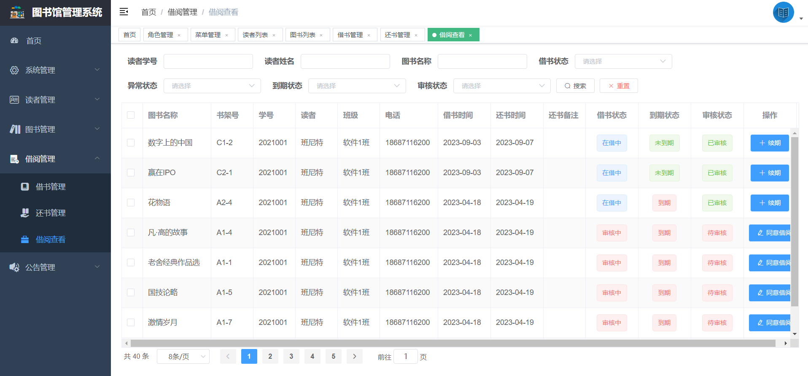

# 基于SpringBoot的图书管理系统 

（源代码+12000字文档+ppt）

## 项目简介

基于SpringBoot的小区物业管理系统，分为图书管理员和读者两个角色。 
读者可以借阅图书、查看自己的借阅自己以及查看公告等，管理员可以对图书、读者、借还书、公告等进行操作。 
本系统前后端分离的系统，前端使用vue+elementui，后端使用springboot框架，数据库使用的是mysql数据库。 
该系统功能完善，界面美观，非常适合作为毕设或者课程作业以及新手开发学习。 

## 功能介绍
 

## 技术服务

## 系统图片
#### 1.登录页面
 
#### 2.管理员首页
 
#### 3.读者管理
 
#### 4.图书管理
 
#### 5.借阅查看
 
#### 6.还书管理
 
#### 7.读者借书管理
 
#### 8.读者借阅记录查看
 
#### 9.读者查看公告
 
